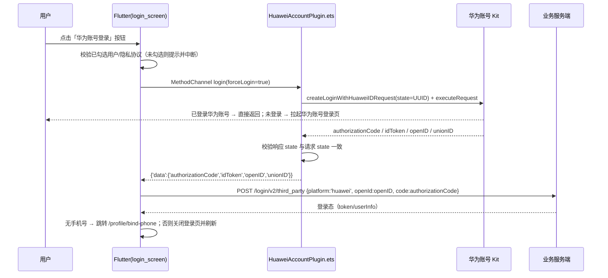

# 华为账号登录（HarmonyOS，自定义按钮）配置说明

> 适用：鸿蒙（OHOS）`/login` 页「第三方账号登录」区域首位的华为账号登录入口。
> Android / iOS 不显示该入口（`Platform.isOhos` 判断），也不需要任何配置。
>
> 场景说明：本项目实现的是官方文档 **《Signing In with a Custom Button》**
> （<https://developer.huawei.com/consumer/cn/doc/doccenter-capabilities/account-unionid-login-api>）
> —— 自绘按钮 + `createLoginWithHuaweiIDRequest`，拿到 UnionID/OpenID/authorizationCode，
> **不获取手机号**，因此**无需**在 AGC 额外申请 `quickLoginAnonymousPhone` 权限。

## 1. 实现结构

| 层 | 文件 | 说明 |
|---|---|---|
| UI | `lib/screens/auth/login_screen.dart` | `Platform.isOhos` 时在第三方区域**最上方**渲染规范样式的「华为账号登录」按钮（`_buildHuaweiLoginButton`），点击调用 `_thirdPartyLogin(Constants.thirdPartyHuawei)`；协议行追加《华为账号用户认证协议》可点击链接 |
| Dart 服务 | `lib/services/huawei_account_service.dart` | MethodChannel `fmlink/huawei_account`，返回统一结构 `{status, data, msg, canceled}` |
| 鸿蒙原生 | `ohos/entry/src/main/ets/huawei/HuaweiAccountPlugin.ets` | `@kit.AccountKit` → `authentication`：`HuaweiIDProvider.createLoginWithHuaweiIDRequest()` + `AuthenticationController.executeRequest()` |
| 注册 | `ohos/entry/src/main/ets/entryability/EntryAbility.ets` | `configureFlutterEngine` 注册插件；`onWindowStageCreate` 注入 `windowStage`（供插件取 ArkUI 页面上下文） |
| 配置 | `ohos/entry/src/main/module.json5` | `module.metadata` 中配置 `client_id` |

## 2. 交互流程



## 3. 前置配置（必须完成，否则登录返回「应用未授权」）

### 3.1 AppGallery Connect 开通华为账号服务

1. 登录 [AppGallery Connect](https://developer.huawei.com/consumer/cn/service/josp/agc/index.html) → 我的项目 → 创建/选择项目 → 添加应用。
2. 应用包名必须为 `com.mpr.chaincode`（与本工程 `ohos/build-profile.json5` 的 product 一致）。
3. 在「API 管理 / 服务」中开通 **华为账号（Account Kit）**。
   - 本场景（自定义按钮 / UnionID 登录）**无需额外申请权限**；
   - 仅当改为「华为账号一键登录（获取手机号）」时，才需申请 `quickLoginAnonymousPhone` 权限（限企业开发者）。
4. 记录 **应用信息 → Client ID**（一串数字），下一步使用。

### 3.2 配置 client_id

`ohos/entry/src/main/module.json5`：

```json5
metadata: [
  {
    name: "client_id",
    value: "6917616558575214481",
  },
],
```

> 当前值 `6917616558575214481` 与本工程调试 profile（`signature/fmlinker-debug.p7b`）的 `app-identifier` 一致；
> 更换签名证书后需要同步更新该值，并在 AGC 登记新证书指纹。

### 3.3 登记公钥指纹（AGC）

华为账号 Kit 会校验调用方应用的**公钥指纹**，未登记时 `executeRequest` 返回 `1001500001`。

> 注意区分两个值：AGC 要的是**公钥（public key）**的 SHA-256，不是证书（certificate）的 SHA-256。

当前调试签名的公钥指纹（= `signature/README.md` 记录的 `edc0f6fe…62d12f`）：

```
ED:C0:F6:FE:A2:3D:1C:58:23:0D:9E:5C:10:27:88:8B:CE:E7:7A:82:4B:39:99:CA:5E:A3:74:3C:97:62:D1:2F
```

获取方式（任选其一）：

```bash
# 1) 从 .cer 取出叶子证书（本工程 .cer 是 Root → 中间 CA → 叶子 三段拼接）
python3 - <<'PY'
import re
pems = re.findall(r'-----BEGIN CERTIFICATE-----.*?-----END CERTIFICATE-----',
                  open('signature/fmlinker-debug.cer').read(), re.S)
open('/tmp/leaf.pem', 'w').write(pems[-1])
PY
openssl x509 -in /tmp/leaf.pem -noout -pubkey \
  | openssl pkey -pubin -outform DER | openssl dgst -sha256

# 2) 或直接看 DevEco Studio：File → Project Structure → Signing Configs 的“公钥指纹”
```

登记步骤（[官方文档：配置签名和指纹](https://developer.huawei.com/consumer/cn/doc/doccenter-capabilities/account-sign-fingerprints)）：

1. 打开 [AppGallery Connect](https://developer.huawei.com/consumer/cn/service/josp/agc/index.html#/myProject) → 「我的项目」。
2. 选择包含 `com.mpr.chaincode` 应用的项目 → 「项目设置」→「常规」。
3. 在「应用」区域找到该应用，展开/点击进入，找到「**公钥指纹**」→「添加」，粘贴上面的 SHA-256（大写、冒号分隔）。
4. 保存，并确认列表中出现该指纹。

生效时间与加速：

- 公钥指纹**最迟 25 小时后生效**。
- 可选加速：配置 10 分钟后，把 `ohos/AppScope/app.json5` 的 `versionCode`（当前 `1`）加 1，重新构建安装即可触发。

其他注意：

1. `ohos/build-profile.json5` 的 `signingConfigs` 指向 `signature/fmlinker-debug.*`（当前调试签名，`app-identifier = 6917616558575214481`，与微信开放平台登记一致），**不要改用 DevEco 自动签名**（个人账号 appIdentifier 不同，会同时打破微信与华为两处登记）。
2. 该工程 `compatibleSdkVersion = 5.0.0(12) < 20`，属于「必须配置公钥指纹」的场景。
3. 发布包需另用发布证书的指纹重新登记；更换签名后必须先卸载旧包：`hdc uninstall com.mpr.chaincode`。

## 4. 关键参数

- `forceLogin`（Dart `HuaweiAccountService.login({bool forceLogin = true})`）
  - `true`：用户未登录华为账号时拉起华为账号登录页（自定义按钮登录场景，默认值）；要求请求运行在 ArkUI 页面上下文中，插件已通过 `windowStage.getMainWindowSync().getUIContext().getHostContext()` 获取（与官方示例一致）。
  - `false`：静默模式，用户未登录时直接返回 `1001502001`（可用于已绑定用户的免弹框登录）。
- `state`：插件用 `util.generateRandomUUID()` 生成，用于防跳站攻击；官方示例要求**响应的 state 必须与请求一致**，插件已做校验，不一致时报 `STATE_MISMATCH`。
- 回传字段：`authorizationCode`（交服务端换 access token / UnionID）、`idToken`、`openID`（应用内唯一，作为服务端 `openId`）、`unionID`。

## 5. 设计规范对照

依据官方《HUAWEI ID Web Login Function ⤍ Log in with HUAWEI ID Button》
（<https://developer.huawei.com/consumer/cn/doc/design-guides/id-0000001880001344>）：

| 规范要求 | 本实现 |
|---|---|
| 自定义按钮流程（`account-unionid-login-api`），按钮形态可自定义 | 与微信/QQ 完全一致的图标按钮：50×50 点击区 + 8 内边距（图形 34×34） |
| 使用华为官方固定配色，图形不裁剪、不变形 | 品牌红 `#CE0E2D` 圆底 + 白色花瓣，`assets/icons/huawei.png`（105×105，四角真透明） |
| 必须位于所有第三方账号登录入口的**最上方**，不能被滚动遮挡 | 第三方图标行**首位（最左）**，微信/QQ 之前 |
| 按钮距屏幕边缘 ≥16vp、图形区不小于 16vp | 页面左右内边距 28vp；图形区 34×34 |
| 图形不随字号缩放变形（大字号最多 3.2×） | 固定尺寸位图，仅高度随 iOS 文本缩放系数 `s` 联动 |
| 用户未接受协议不得登录，直接点击需**明确提醒** | 未勾选时 toast「请先阅读并同意《用户协议》《隐私政策》和《华为账号用户认证协议》」，不拉起授权页 |
| 登录页必须展示《华为账号用户认证协议》且可查看详情 | 协议行新增可点击链接（仅 OHOS 展示，webview 打开华为页面） |
| 登录中需防重复点击 | `_isLoading` 期间忽略再次点击 |
| 不得向用户透传原始错误码 | 原生 `mapError` 只返回友好文案，错误码仅写入 hilog 与 `PlatformException.details` |

> 形态说明：官方《HUAWEI ID Web Login Function》中「Log in with HUAWEI ID Button」一节对
> 官方按钮样式（纯文字 / logo+文字 / 仅 logo、宽 ≥150vp、文案固定不可改）有更严格要求。
> 本项目按产品要求采用与微信/QQ 统一的**方形图标按钮**（对应「仅 logo」形态），
> 保留华为固定配色与首位展示。若后续上架审核对该形态有异议，可改为「logo + 文字」
> 全宽按钮（参数见 design-guides id-0000001880001344）。

> 图标资源：仅使用 `assets/icons/huawei.png`（红圆底 + 白花瓣，105×105，四角透明）。
> ⚠ macOS `qlmanage` 渲染 SVG 时输出的是**不透明白底**，直接拿它的产物会出现白底/白角；
> 本次做法：`qlmanage` 渲染 512px → 用临时 Python 脚本按圆几何做像素级透明遮罩（边缘用红色
> 与逐像素 alpha 修正）→ `sips -z 105 105` 输出。

## 6. 错误码对照（Dart 侧 `PlatformException.code`，用户可见文案不包含错误码）

| 华为错误码 | Dart code | 用户可见文案 |
|---|---|---|
| 1001500001 | `PACKAGE_FINGERPRINT_CHECK_ERROR` | 华为账号登录暂不可用，请稍后重试或使用其他方式登录 |
| 1001502001 | `ACCOUNT_NOT_LOGGED_IN` | 请先登录华为账号后重试 |
| 1001502002 | `APP_NOT_AUTHORIZED` | 华为账号登录暂不可用，请稍后重试或使用其他方式登录 |
| 1001502005 | `NETWORK_ERROR` | 网络异常，请检查网络后重试 |
| 1001502012 | `USER_CANCELED` | 已取消华为账号登录（业务侧不弹错误提示） |
| 1001500002 | `DUPLICATE_REQUEST` | 登录请求正在处理中，请稍候 |
| 1001500003 / 1001500004 | `UNSUPPORTED` | 当前华为账号暂不支持该登录方式，请使用其他方式登录 |
| 12300001 | `SYSTEM_SERVICE_ERROR` | 华为账号服务异常，请稍后重试 |
| 其他 | `HUAWEI_LOGIN_FAILED` | 华为账号登录失败，请重试 |
| —（插件侧） | `STATE_MISMATCH` | 登录校验失败，请重试 |
| —（插件侧） | `EMPTY_CREDENTIAL` | 未获取到华为账号授权信息，请重试 |

## 7. 验证

```bash
flutter run -d <ohos-device>      # 或 flutter build hap
# 真机日志（插件 TAG = HuaweiAccountPlugin）
hdc shell hilog | grep -iE "HuaweiAccountPlugin|Authentication"
```

- 正常：点击第三方登录行最左侧的**华为图标** → 首次弹华为账号授权页 → 授权后服务端登录成功；已登录华为账号时不再弹页直接登录。
- 未勾选协议就点按钮：toast 提醒需先同意三个协议，且不会拉起华为账号页。
- 未开通华为账号服务 / 未登记公钥指纹：toast「华为账号登录暂不可用…」，控制台 `华为账号登录失败 code=PACKAGE_FINGERPRINT_CHECK_ERROR details=1001500001`。
- 非鸿蒙平台不显示该按钮；若强行调用，Dart 侧返回「当前平台暂不支持华为账号登录」。
- 改了 `ohos/entry/src/main/ets/**` 后**必须重新构建安装**，热重载/热重启不生效。
